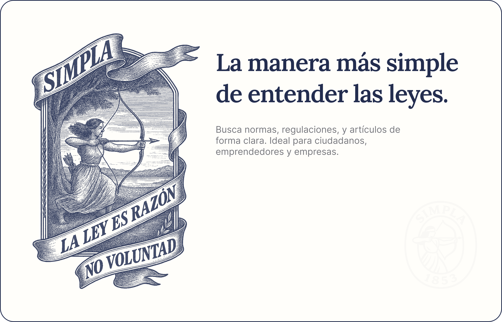

# Simpla



## Cómo levantar el proyecto

Requiere Docker y Make.

1. Clonar el repo.
2. Levantar los contenedores:

```bash
make up
```

Eso arranca:

- PostgreSQL (con esquema precargado)
- API en FastAPI (`localhost:8000`)
- Frontend en Next.js (`localhost:3000`)

## Acciones útiles

- `make import-data` → Carga los 3 CSVs en la base.

> [!Note] Para que funcione este comando los csvs tienen que estar en ./data

- `make test` → Ejecuta tests del backend.
- `make logs` → Muestra logs de todos los servicios.
- `make shell-api` / `shell-db` / `shell-front` → Accede a contenedores.

Más comandos disponibles con:

```bash
make help
```

---

Los csv's se pueden descargar pegandole a la
[API pública CKAN](https://datos.gob.ar/acerca/ckan) o descargando del
[Dataset - Base Infoleg de Normativa Nacional](https://datos.gob.ar/dataset/justicia-base-infoleg-normativa-nacional).
